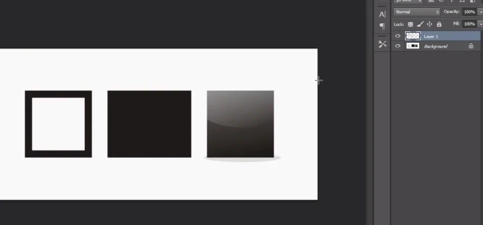

# Rectangular Marquee Tool, Move Tool, Elliptical Marquee Tool, , Lasso Tool , Polygonal Lasso Tool, Magnetic Lasso Tool, Save</h2>

---

- Rectangular Marquee Tool == Eliptical Marquee Tool, tergantung kenyamanan

---

## Rectangular Marquee Tool

1. klik Rectangular Marquee Tool

2. Seleksi Object

3. Kembali ke move tool

4. Copy / tekan ctrl+j(untuk mengcopy sebuah object yang sebelumnya sudah kita seleksi menggunakan Marquee Tool), akan membentuk sebuah layer baru</li>

5. kita bisa memberi nama pada layer supaya ketika bekerja dibanyak layer kita bisa memberi nama setiap layernya agar nanti tidak bingung.</li>
cara : klik 2X pada tulisan layernya(nama bebas)

---

## Move Tool
- Fungsi : Menggeser2 object

---

## Elliptical Marquee Tool

- Fungsi : Menyeleksi sebuah object yang bentuk objectnya itu bulat
- caranya hampir sama dengan Rectangular Mqrquee Tool

1. Klik Elliptical Marquee Tool
2. seleksi gambar

3. tekan ctrl+j

4. Hasil : 

---

## Pengen mengambil object

- Pengen mengambil object membuang background = Lasso Tool, Polygonal Lasso Tool, Magnetic Lasso Pen Tool
- tergantung kenyamanan

---

## Lasso Tool

- menyeleksi secara bebas, tapi belum terlalu mahir jadi agak susah

---

- Untuk menggeser gambar ketika menyeleksi tekan = space

---

## Polygonal Lasso Tool

- lebih enak digunakan untuk menyeleksi sebuah object yang lurus
- karena Polygonal Lasso Tool itu lurus seleksinya

---

## Untuk mengezoom

- Window
- Navigator

- atau bisa tekan tombol ctrl + / ctrl + -

---

## Magnetic Lasso Tool

- Menyeleksi mengikuti contour2

---

## Save

1. File
2. Save As...

---

## type

- .JPEG, .webp .PSD (filenya photoshop bisa dibuka diphotoshop lagi)
- saran untuk object tanpa background simpan dalam bentuk = png

