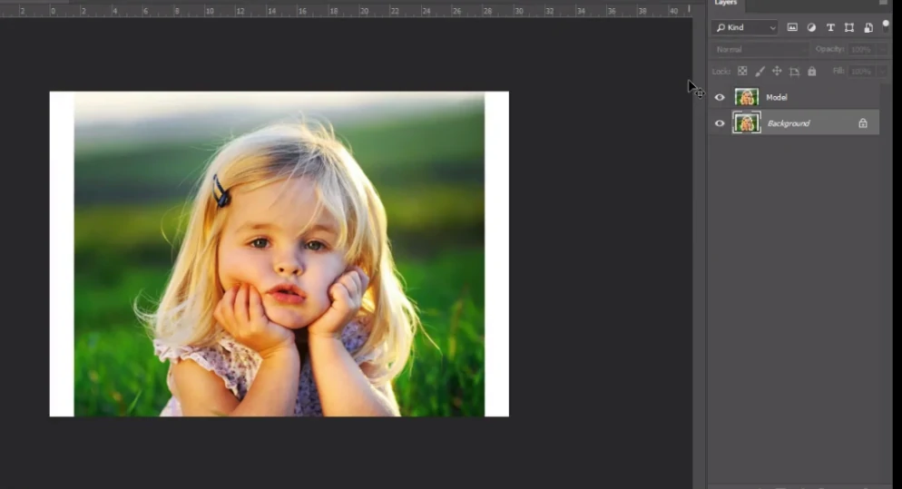

# Image Size, Canvas Size, Image Rotation

---

## Image Size

- Mengecek ukuran sebuah gambar dan mengubah, merubah ukuran, mengubah resolusi dari foto/ kualitas foto

1. Siapkan gambar
2. Edit > Image > Image Size

---

## Canvas Size

- untuk merubah ukuran canvas / lembar kerja
1. Image > Canvas Size

2. Rubah ke A4

3. Hasil :
