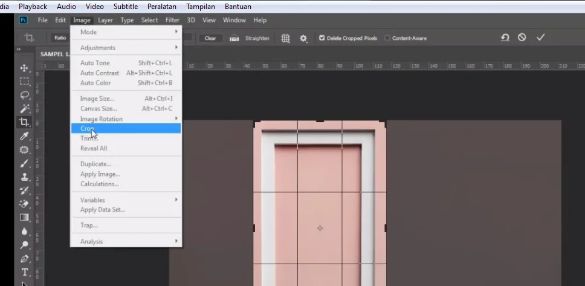
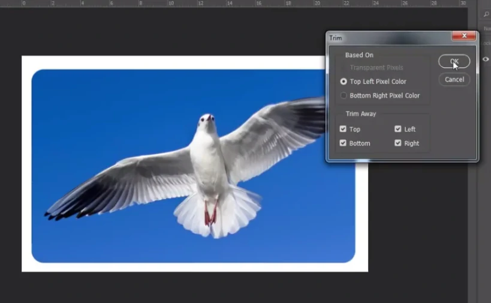
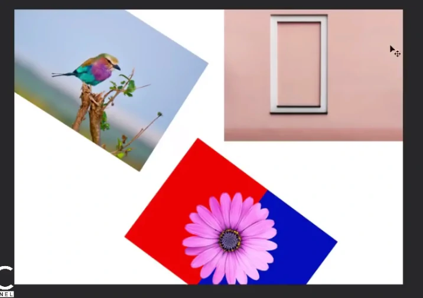
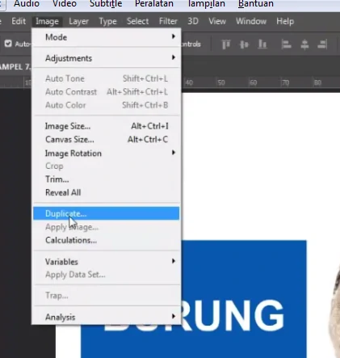

# Crop, Trim, Reveal All, Duplicate

---

## Crop

- untuk memotong / crop

1. Siapkan gambar

2. Pilih Crop

3. Tarik untuk memotong

4. Jika sudah tekan enter / click crop / click tanda centang

---

## Trim

- untuk memotong area yang putih saja

1. Siapkan gambar, crop sampai hasilnya seperti ini

2 .Image > Trim

3. OK

---

## Reveal All

- Agar Background putih sesuai dengan object

1. Image > Reveal All

2. Hasil :

---

## Duplicate

- digunakan untuk menduplikate / mengcopy (sebuah document)

