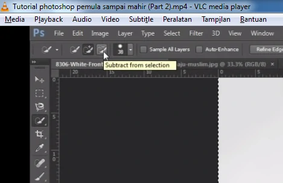

# Quick Selection Tool, Magic Wand Tool, Crop Tool, Eyedropper Tool

---

## Quick Selection Tool

- New Selection = menambah seleksi baru
    
- Seleksi object
    
- Merapikan Seleksi
    
    
- membalik seleksi (karena ini yang diseleksi background bukan model/ object)
  - select
  - invert (ketika sebelum invert seleksinya mengelilingi background, ketika kita invert seleksinya mengelilingi object)
  
  
  - copy = ctrl + j
  

---

## Magic Wand Tool

### Menyeleksi Background 1 Warna

- klik Magic Wand Tool

- klik dibackground

- kita move tool > invert

- ctrl + j

---

## ketika kit a lihat masih ada sisa

- kita seleksi dengan magic wand tool

- lalu tekan del = untuk menghilangkan bagian yang diseleksi

---

## Crop Tool

- klik crop

- tarik crop

- tekan enter

---

## Eyedropper Tool

- sebuah tool untuk mengambil sample warna pada sebuah object

---

## Membuat background pada object

1. seleksi object
2. hapus background

3. kita buat layer baru

4. kita buat dilayer baru sebuah kotak menggunakan Rectangle Tool

5. klik dilayer background 2x

6. klik di warna yang diinginkan

7. otomatis background langsung berubah jadi merah
