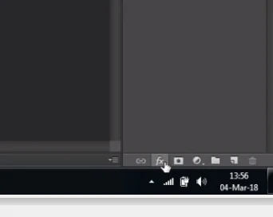
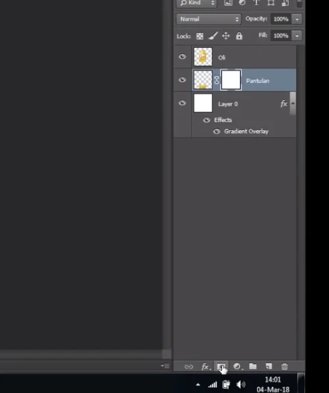

# Eraser Tool, Gradient Tool, fx, tranform, layer mask, , Paint Bucket Tool

---

## Eraser Tool

- Menghapus

1. Atur gambar

2. Klik eraser Tool

3. klik / seret untuk menggunakan

---

- c trl + t = mengecilkan object
- shift = untuk mengatur gambar agar atas bawah tidak berubah

---

## Gradient Tool

1. Buat Document baru

2. Orange yellow orange

3. Linear Gradient

4. Klik dari atas tarik ke bawah

5. ganti warna

---

## agar tombol fx aktif (kanan)
1. klik layer background
2. ok

3. fx bisa untuk gradient

---

## Example Gradient

1. Atur warna gradient

2. Pilih radial

3. Mengatur lewat fx

4. Masukkan gambar / object

5. Buat pantulan > ctrl + j

6. Balik pantulan > rotate 180

7. Atur letak pantulan

8. Layer mask » untuk menyembunyikan sebagian dari object

9. atur gradient

10. Balik

11. pilih gradient

12. tarik dari bawah ke atas

---

## Paint Bucket Tool

- Mengisi warna sebuah document baru / object baru
1. file baru

2. klik di 2 kotak hitam putih

3. pilih warna

4. klik paint bucket tool

5. klik objectnya

