# Blur Tool, Sharpen Tool, Smudge Tool, , Dodge Tool & Burn Tool, Sponge Tool

---

## Corel dan Photoshop saling mendukung

- jika tidak ada efek diphotoshop bisa ke corel draw
- corel draw bisa diexport ke photoshop

---

## Blur Tool

- mengeblur sebuah gambar
1. klik Blur Tool
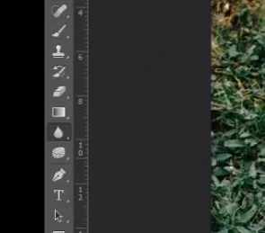
2. atur size
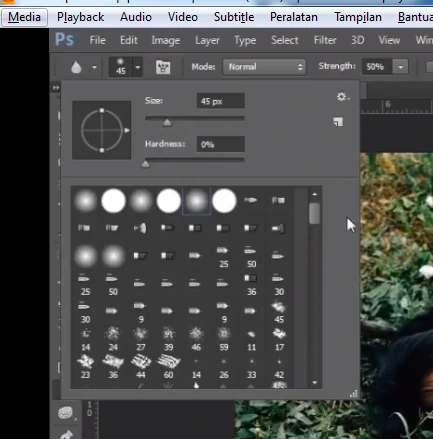
3. atur strength = kekuatan blur
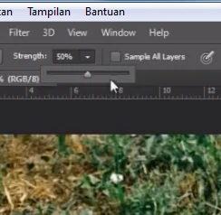
4 .copy supaya bisa melihat perbedaan sesudah dan sebelum blur
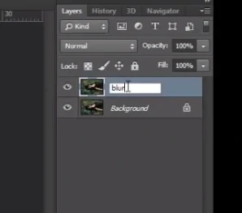

---

## Blur tool untuk memperhalus tepian sebuah object

1. seleksi quick seleksi tool
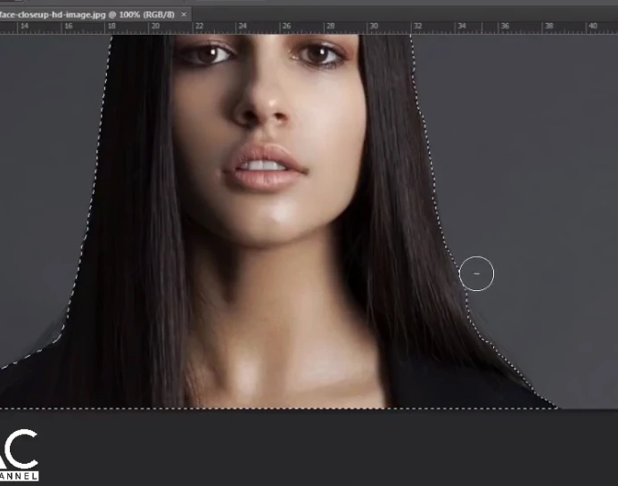
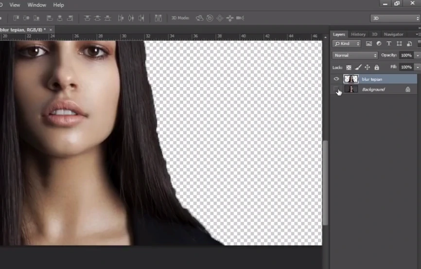
2. kita naikkan strength 100%
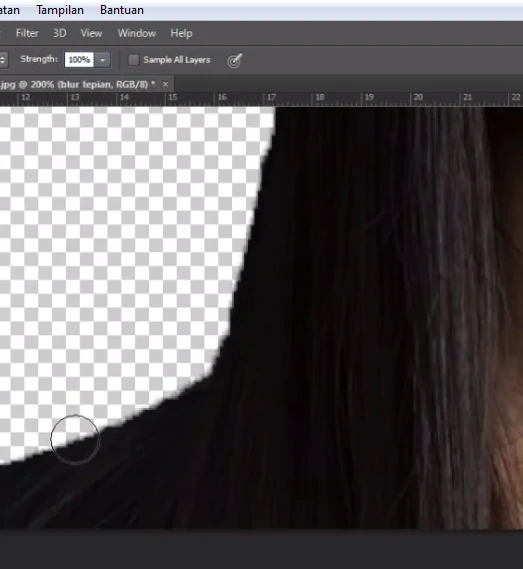
3. kasih background agar keliatan hasilnya, pilih layer, klik gambar folder, klik solid layer
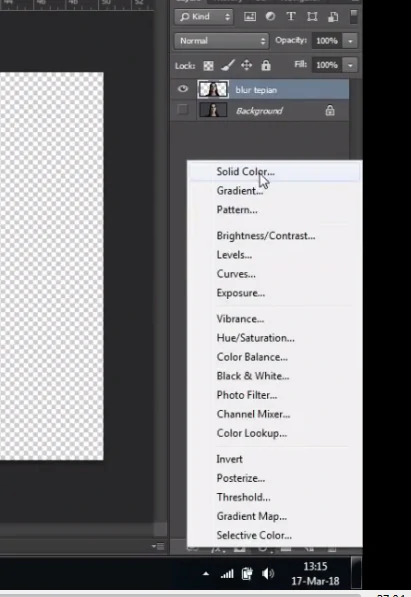
4. Tarik ke bawah
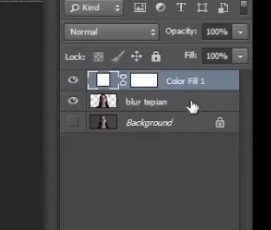
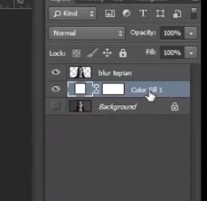

---

## Sharpen Tool

- Mempertajam gambar
1. Klik Sharpen Tool
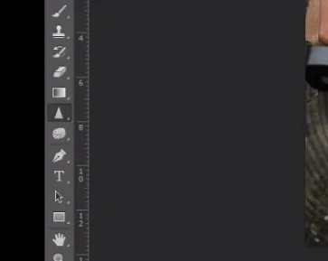
2. copy layer
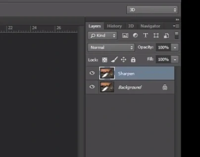
3. matikan layer backgroud & atur strength 50%
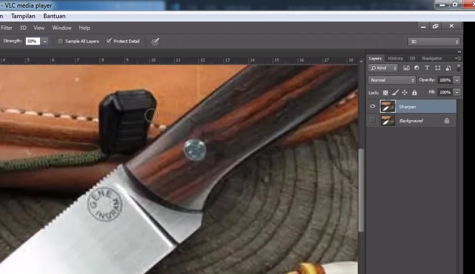
4. Hasil :
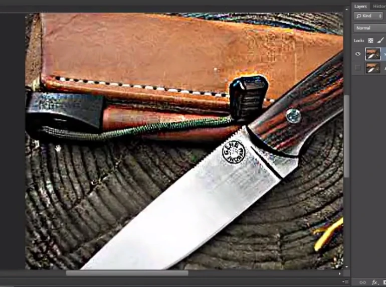

---

## Smudge Tool

- Menggosok / mengkilatkan object
1. Klik Smudge Tool
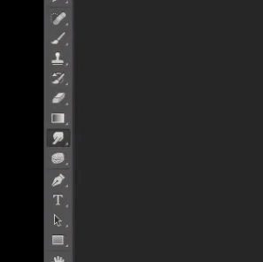
2. gosok object
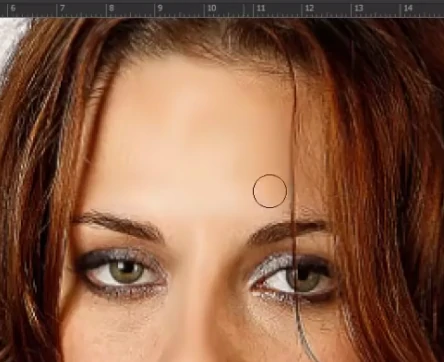

---

## Dodge Tool & Burn Tool

### Dodge Tool
- untuk mempertegas bagian cerah pada gambar
1. klik dodge tool
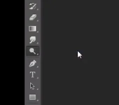
2. gosok gambar yang cerah pada gambar
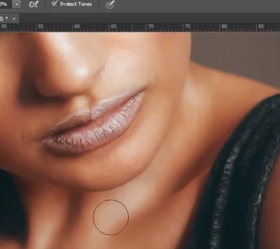

### Burn Tool 
- untuk mempertegas bagian yang gelap pada gambar
1. Klik Burn Tool
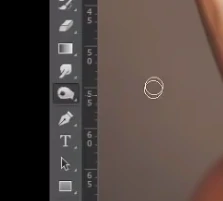
2. gosok object pada yang gelap
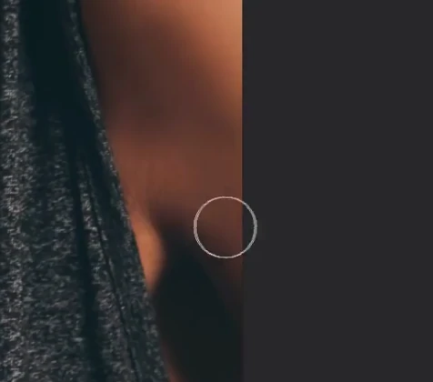

---

## Sponge Tool

### Desaturate 

- untuk memberikan efek pemudaran / saturasi pada warna, kehilangan warna aslinya (hitam putih)

1. klik sponge tool
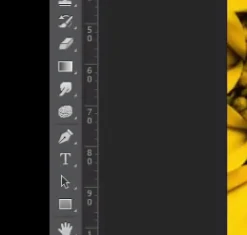
2 pilih desaurate
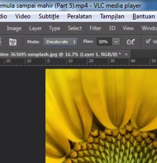
3. gosok gambar
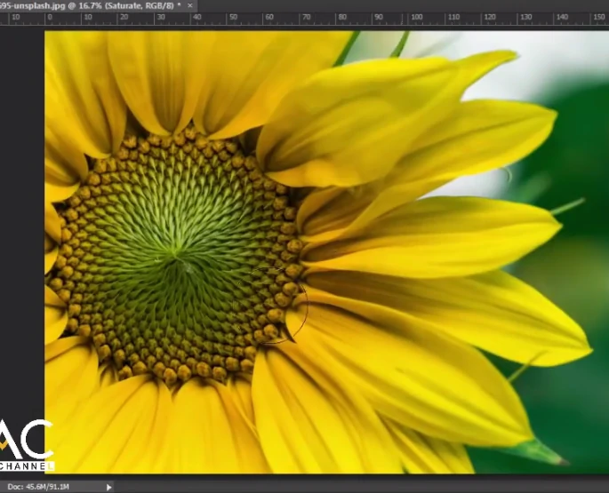
### Saturete 

- untuk meningkatkan saturasi warna(mempertajam warna)
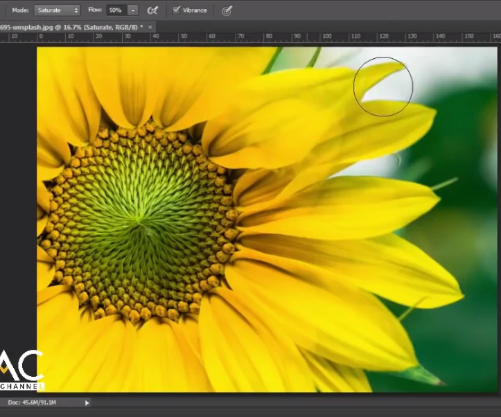