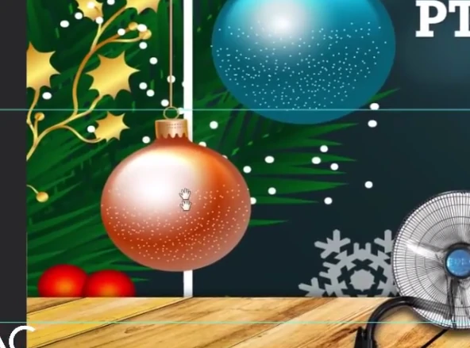
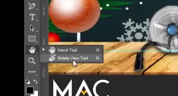
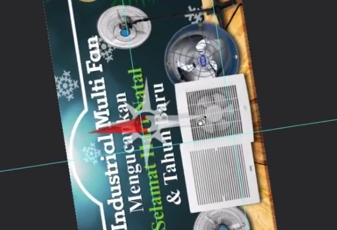
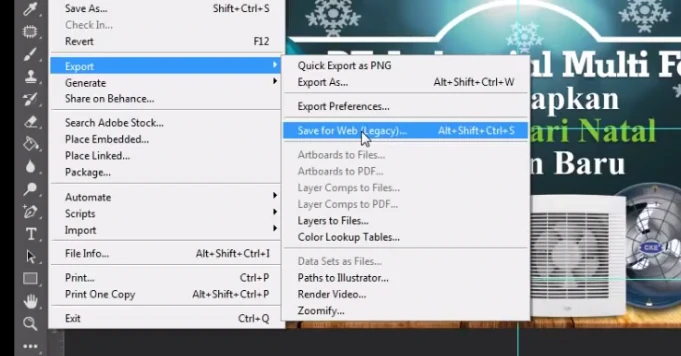
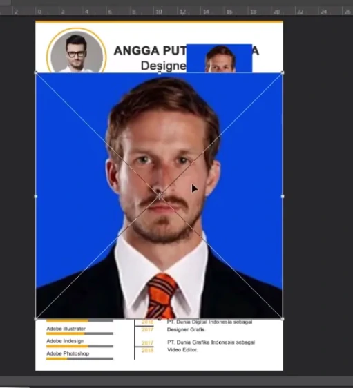
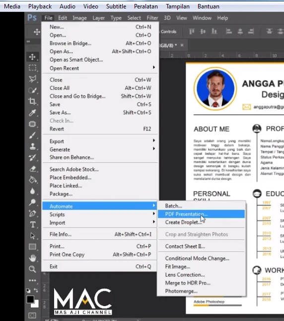
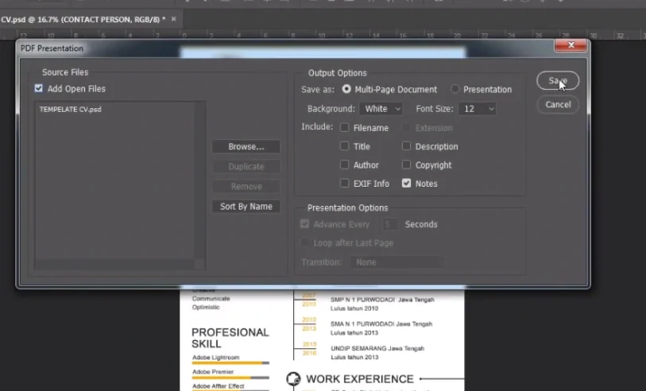

# Hand Tool, Rotate View Tool, Zoom Tool, Save, Save As, Export, Place Embedded, Automate

---

## Hand tool

- untuk menggeser lembar kerja / object yang kita bikin diarea lembar kerja
- shortcut : space

---

## Zoom Tool

- untuk mengezoom gambar
- ctrl + : membesarkan
- ctrl - : mengecilkan

---

## Rotate View Tool

- untuk memutar object
- mungkin mendesain sesuatu viewnya perlu dibalik
- shortcut : L

---

## Save

- Jaga2 sewaktu2 not responding / tidak ke backup
- Save As : digunakan untuk ditimpakan / replace
- save as juga bisa ganti pilihannya / type

---

## Export

- biasanya digunakan untuk membuat desain2 untuk banner2 / iklan jika ditampilkan diwebsite agar
- ukurannya lebih kecil dengan kualitas yang sama

---

## Place Embedded / Place

- memasukkan object tapi langsung kelembar kerja kita tanpa kita harus menggeser

---

## Automate

- untuk membuat desain menjadi PDF
- biasanya untuk melamar kerja karena biasanya dengan format PDF
1. Automate
2. PDF Presentation

